# 📊 视频分析流程图

**文档版本**: v1.1
**创建时间**: 2025-12-17
**最后修订**: 2026-08-30
**适用范围**: `src/` 下的视频分析处理链路

> **关于本文档的时效性**
>
> 本文档最初记录的是命令行程序 `analyze_video.py` 的执行流程。该 CLI 入口此后被
> Streamlit 工作台（`web_interface.py`）取代，处理逻辑被拆分进 `src/` 各模块，
> `analyze_video.py` 本身已不存在。
>
> 文中的**处理逻辑**——切片窗口与重叠、时间戳校正、错误合并、流式重试、防幻觉约束——
> 与当前 `src/web/analyzer.py`、`src/processing/slicer.py`、`src/core/utils.py`
> 的实现一致，仍然有效，这也是保留本文档的原因。
>
> 但涉及**命令行调用方式**的段落（如 `python analyze_video.py ...`）仅供理解历史流程，
> 不可照抄执行。实际运行方式见根目录 [README.md](README.md)。

---
## 🎯 程序整体流程概览
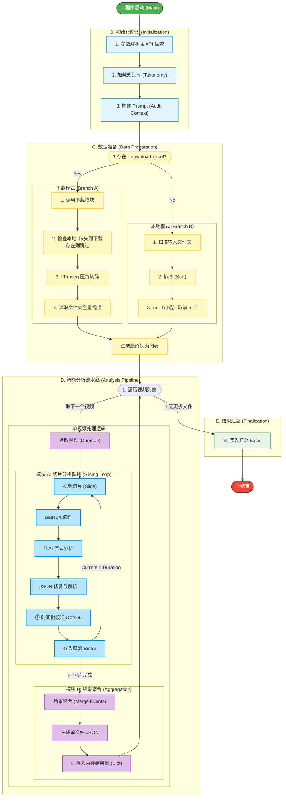

---
## Context Engineering

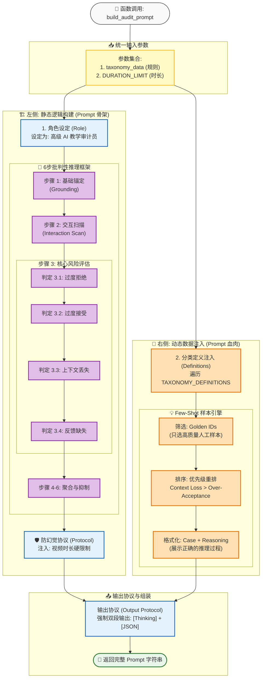

---

## 🎮 AI交互流程

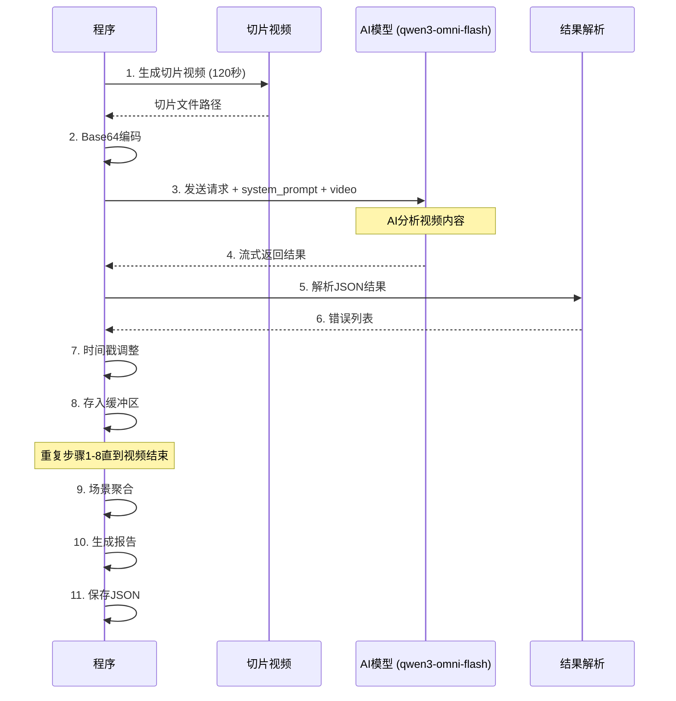

**AI交互细节**:

#### 请求参数
```python
completion = client.chat.completions.create(
    model="qwen3-omni-flash",  # 硬编码于 src/web/analyzer.py
    messages=[
        {"role": "system", "content": system_prompt},
        {"role": "user", "content": [
            {
                "type": "video_url",
                "video_url": {"url": f"data:;base64,{b64_str}"}
            },
            {
                "type": "text",
                "text": "请分析此片段，如有严重错误请输出JSON。"
            }
        ]}
    ],
    modalities=["text"],
    stream=True,
    temperature=0.2,
    frequency_penalty=1.0,
    max_tokens=2048
)
```

#### 看门狗机制
```python
# 检测关键词重复（"不过"）
if "不过" in new_text:
    loop_trigger_count += 1
if loop_trigger_count > 5:
    break  # 强制熔断

# 检测输出过长
if len(full_content) > 6000:
    break  # 强制熔断
```

---

## 📖 详细流程分解

### 🔹 阶段0：程序入口

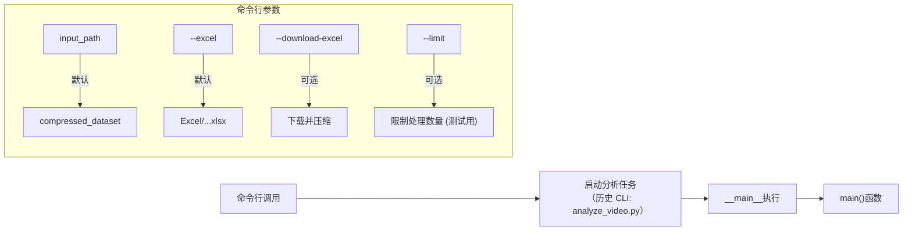

---

### 🔹 阶段1：初始化阶段

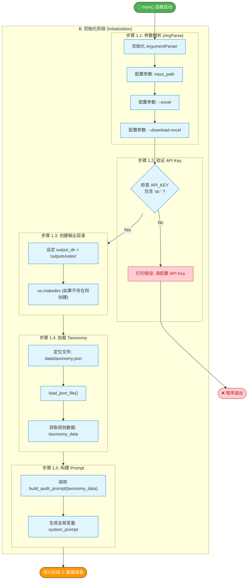

**关键配置参数**:
```python
CHUNK_DURATION = 120       # 切片时长：120秒（2分钟）
OVERLAP_DURATION = 20      # 重叠时长：20秒
WINDOW_STEP = 100          # 窗口步长：120-20=100秒
```

---

### 🔹 阶段2：视频处理阶段

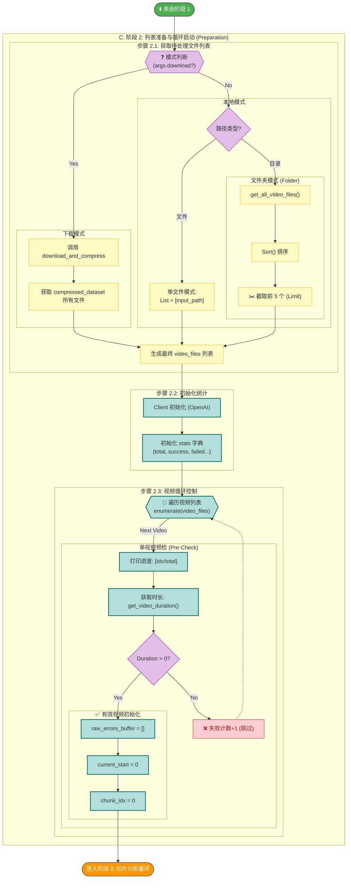

---

### 🔹 阶段3：切片分析循环（核心）

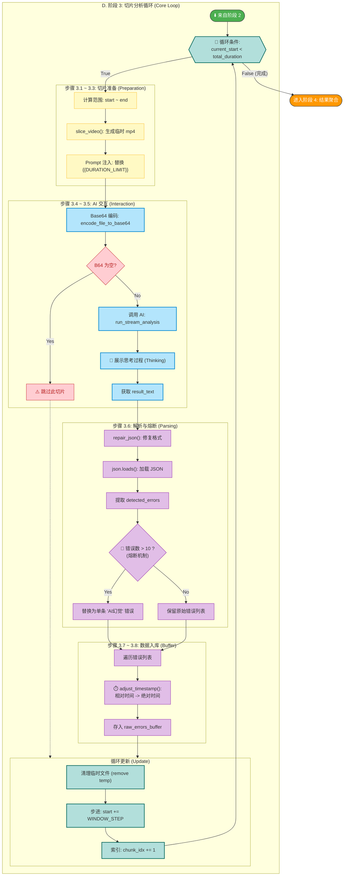

---

### 🔹 阶段4：后处理阶段（场景聚合）

```mermaid
graph TD
    %% ==========================================
    %% 1. 样式定义
    %% ==========================================
    classDef startNode fill:#FF9800,stroke:#333,color:#fff
    classDef nextNode fill:#4CAF50,stroke:#333,color:#fff
    classDef logic fill:#e1bee7,stroke:#8e24aa
    classDef io fill:#fff9c4,stroke:#fbc02d
    classDef mem fill:#e1f5ff,stroke:#0077be

    %% ==========================================
    %% 2. 节点与流程
    %% ==========================================
    Start(["⬇️ 切片循环结束 (Single Video Done)"])
    Next(["🔄 返回主循环 (处理下一个视频)"])

    subgraph Phase4 ["E. 阶段 4: 单视频聚合与归档 (Post-Processing)"]
        direction TB

        %% --- 步骤 4.1: 聚合 ---
        subgraph Step_4_1 ["步骤 4.1: 全量场景聚合 (Logic)"]
            direction TB
            M1["输入: raw_errors_buffer<br/>(所有切片的原始数据)"]
            M2["调用 merge_overlapping_events()<br/>(去重 + 时间段合并)"]
            M3["输出: final_cleaned_errors"]
            
            M1 --> M2 --> M3
        end

        %% --- 步骤 4.2: 报告构建 ---
        subgraph Step_4_2 ["步骤 4.2: 构建数据对象"]
            direction TB
            R1["构建 final_report 字典"]
            R2["包含: metadata, all_detected_errors"]
            
            R1 --> R2
        end

        %% --- 步骤 4.3: JSON 落盘 ---
        subgraph Step_4_3 ["步骤 4.3: 保存单文件 JSON"]
            direction TB
            J1["生成文件名: {filename}_video.json"]
            J2["json.dump() 写入磁盘"]
            J3["保存至: outputs/video/"]
            
            J1 --> J2 --> J3
        end

        %% --- 步骤 4.4: 内存更新 ---
        subgraph Step_4_4 ["步骤 4.4: 更新运行态内存"]
            direction TB
            U1["更新全量字典:<br/>all_results[video_path] = final_report"]
            U2["更新统计:<br/>stats['success'] += 1<br/>stats['errors_found'] += N"]
            
            U1 --> U2
        end

        %% --- 内部连接 ---
        M3 --> R1
        R2 --> J1
        J3 --> U1
    end

    %% ==========================================
    %% 3. 外部连接
    %% ==========================================
    Start --> M1
    U2 --> Next

    %% ==========================================
    %% 4. 样式应用
    %% ==========================================
    class Start startNode
    class Next nextNode
    class M1,M2,M3 logic
    class J1,J2,J3 io
    class R1,R2,U1,U2 mem
```

---

### 🔹 阶段5：完成与统计

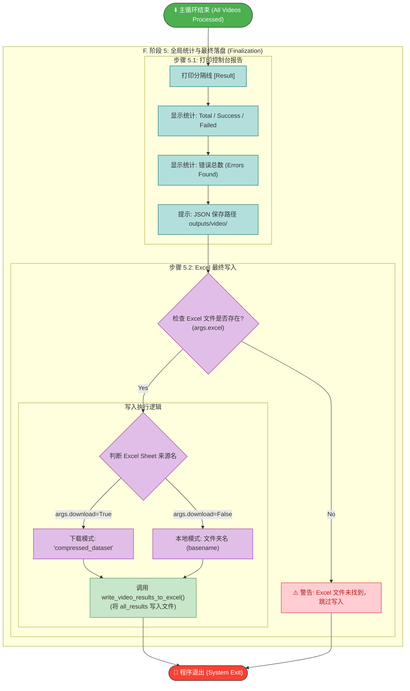

---

## 🔄 核心算法详解

### 算法1: 滚动切片策略

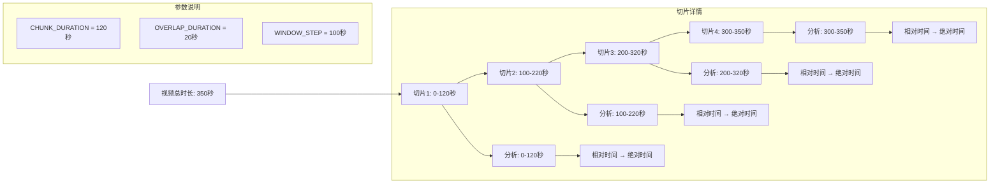

**算法描述**:
```
输入: 视频总时长 T, 切片时长 C, 重叠时长 O
输出: N 个切片

初始化:
  start = 0
  step = C - O

当 start < T:
  end = min(start + C, T)
  创建切片: [start, end]
  start += step

返回所有切片
```

**示例**:
- 视频时长: 350秒
- 切片时长: 120秒
- 重叠: 20秒
- 切片数量: 4个
- 切片范围:
  1. 0-120秒
  2. 100-220秒
  3. 200-320秒
  4. 300-350秒

---

### 算法2: AI响应解析流程

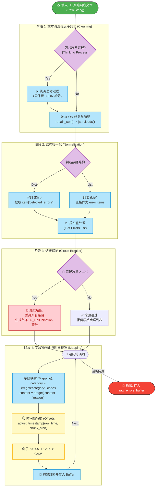

**熔断机制**:
```python
if len(errors) > 10:
    # AI在此片段产生幻觉，输出过多记录
    errors = [{
        "timestamp": "00:00",
        "code": "System_AI_Hallucination",
        "reason": "AI在此片段产生幻觉，输出过多记录，已拦截。"
    }]
```

---

### 算法3: 时间戳调整

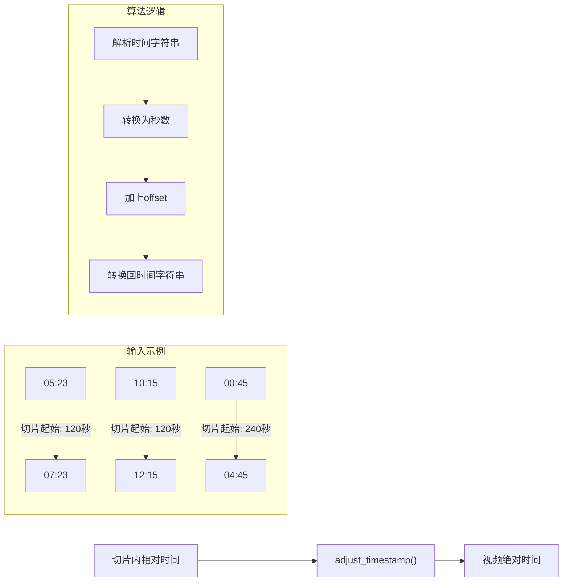

**时间戳格式支持**:
- `MM:SS` → 例如: "05:23" (5分23秒)
- `HH:MM:SS` → 例如: "01:05:23" (1小时5分23秒)

---

### 算法4: 事件聚合

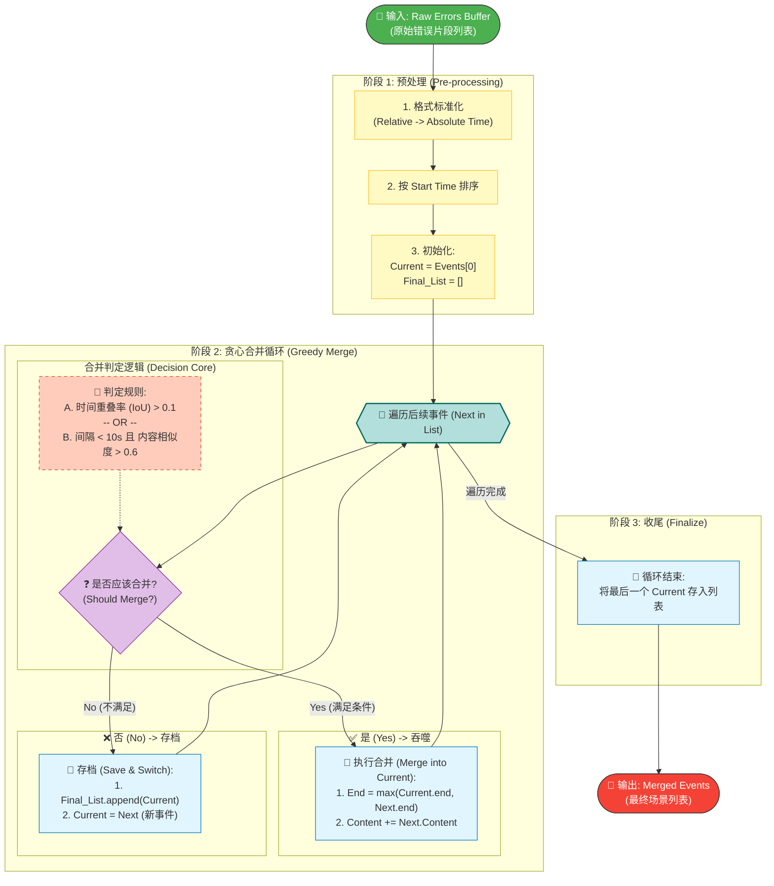

**合并规则详解**:

#### 规则1: 时间重叠
```python
def calculate_iou(start1, end1, start2, end2):
    """计算时间交并比"""
    intersection = max(0, min(end1, end2) - max(start1, start2))
    union = max(end1, end2) - min(start1, start2)
    return intersection / union if union > 0 else 0

# 只要IoU > 0.1 (10%重叠)就合并
should_merge = iou > 0.1
```

#### 规则2: 时间接近 + 内容相似
```python
def is_text_similar(text1, text2, threshold=0.6):
    """计算文本相似度"""
    return SequenceMatcher(None, text1, text2).ratio() > threshold

# 中心点距离 < 10秒 且 内容相似度 > 0.6
time_close = abs(center1 - center2) < 10
text_sim = is_text_similar(content1, content2)
should_merge = time_close and text_sim
```

#### 合并操作
```python
# 1. 时间取并集 (扩宽)
new_start = min(current['_start_sec'], next_err['_start_sec'])
new_end = max(current['_end_sec'], next_err['_end_sec'])

# 2. 内容取最长的
desc1 = current.get('content', '')
desc2 = next_err.get('content', '')
new_content = desc1 if len(desc1) > len(desc2) else desc2

# 3. 更新当前事件
current['_start_sec'] = new_start
current['timestamp_start'] = seconds_to_timestamp(new_start)
# ... 其他字段更新
```

---

## 📊 数据流图

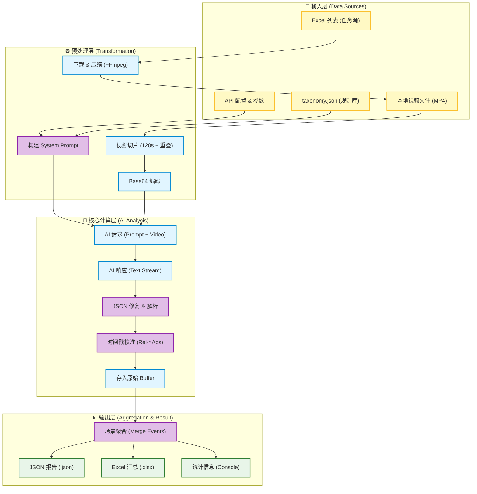

**数据转换过程**:

1. **准备阶段 (Raw Data → Input)**
   ```
    规则注入: taxonomy.json + Config → System Prompt (上下文注入)
    视频准备: Excel URL → 下载流 → FFmpeg压缩 → 本地 MP4
   ```

2. **切片阶段 (Video → AI Input)**
   ```
    本地 MP4
    → 视频切片 (120s 窗口, 20s 重叠)
    → 临时文件 (.mp4)
    → Base64 编码 (Data URI 字符串)
    → API 请求体 (Prompt + Video Base64)
   ```

3. **分析阶段 (AI Output → Raw Data)**
   ```
    AI 文本响应 (Stream)
    → JSON 修复 (repair_json)
    → Python Dict/List 对象
    → 相对时间 (00:05) + 切片偏移 (100s)
    → 绝对时间 (01:45)
    → 存入 raw_errors_buffer
   ```

4. **聚合阶段 (Raw Data → Final Report)**
   ```
    raw_errors_buffer (碎片数据)
    → Merge Overlapping Events (去重/时间合并/内容融合)
    → final_cleaned_errors (结构化事件)
    → JSON 文件 (完整报告)
    → Excel 行 (统计汇总)
   ```

---

## 🎯 错误处理机制

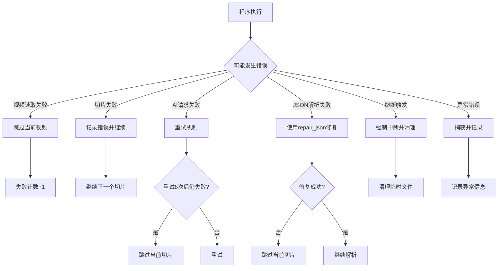

**具体错误处理代码**:

1. **视频读取失败**
```python
total_duration = get_video_duration(video_path)
if total_duration == 0:
    print(f"[Error] 无法读取视频时长，跳过")
    stats['failed'] += 1
    continue
```

2. **AI请求失败**
```python
# 使用tenacity自动重试（最多8次）
@retry(wait=wait_exponential(min=5, max=60), stop=stop_after_attempt(8))
def run_stream_analysis(...) -> str:
    # AI调用逻辑
```

3. **JSON解析失败**
```python
try:
    fixed_json_str = repair_json(result_text)
    parsed = json.loads(fixed_json_str)
except Exception as e:
    print(f"\n    ❌ [解析严重失败]: {e}")
```

4. **熔断机制**
```python
# 1. 关键词重复检测
if "不过" in new_text:
    loop_trigger_count += 1
if loop_trigger_count > 5:
    break

# 2. 输出过长检测
if len(full_content) > 6000:
    break
```

---

## 📂 输入输出说明

### 输入文件

1. **命令行参数**（历史形态；该 CLI 入口已移除，当前入口见 [README.md](README.md)）
   ```bash
   python analyze_video.py [input_path] [--excel path] [--download-excel path]
   ```

2. **配置文件**
   - `src/config.py`: API Key、质检规则库路径
   - `data/taxonomy.json`: 质检规则库（few-shot 示例）

3. **视频文件**
   - 路径: `compressed_dataset/` 或指定路径
   - 格式: MP4 (已压缩至720p)
   - 大小: < 20MB

### 输出文件

1. **JSON报告**
   ```json
   {
     "metadata": {
       "source": "视频文件路径",
       "total_duration": 350.5
     },
     "all_detected_errors": [
       {
         "timestamp_start": "01:23",
         "timestamp_end": "01:45",
         "category": "讲解错误",
         "content": "教师讲解内容有误"
       },
       ...
     ]
   }
   ```
   - 保存位置: `outputs/video/视频文件名_video.json`

2. **Excel结果**
   - 写入位置: `--excel` 指定的Excel文件（新Sheet）
   - Sheet名称: `_{folder_name}` (例如: `_compressed_dataset`)
   - 内容: 整合所有视频的错误到Excel

3. **统计信息**
   ```
   [Result] 批量视频分析完成
     总计文件: 100
     ✓ 成功: 98
     ✗ 失败: 2
     发现错误总数: 156
   ```

---

## 📈 性能指标（仅做示例）

### 时间消耗分布

### 内存消耗

---

## 🔍 关键函数映射

---

## 💡 最佳实践

### 配置建议

### 使用场景

---

## 📝 总结

### 程序特点

### 适用场景

### 注意事项

---